<hr style="width:90%;border:none;height:1px;background-color:#ccc;margin:2em auto;margin-top:8em">
<div style="font-family:Arial,sans-serif;font-size:5em;line-height:1.2;margin:0.5em auto;text-transform:uppercase;color:#2a4d69;text-align:center;width:85%">
  Ein numerisches Modell und Simulation des Flugs einer Wasserrakete
</div>
<hr style="width:90%;border:none;height:1px;background-color:#ccc;margin:2em auto;">
<p style="font-family:Arial,sans-serif;font-size:1.5em;line-height:1.5;max-width:600px;margin:1.5em auto;text-align:left;color:#333;">
In diesem Artikel wird ein mathematisches Modell für den Flug einer Wasserrakete vorgestellt. Es berücksichtigt den Rückstoß durch Wasser und Luft, die Schwerkraft sowie den Luftwiderstand. Mit Hilfe eines Computerprogramms wird der Flug in kleinen Zeitschritten simuliert. Ziel ist es, den Flugverlauf besser zu verstehen und günstige Startbedingungen zu finden.
</p>


<h1>Inhaltsverzeichnis</h1>


[TOC]

# I. Mathematisches Modell

## 1. Grundidee

Eine Wasserrakete durchläuft drei Hauptphasen:

1. **Phase I: Antrieb durch Wasser**
   * Beginnt bei **t = 0** und endet, wenn das gesamte Wasser ausgestoßen ist.
2. **Phase II: Antrieb durch Luft**
* Nachdem das gesamte Wasser ausgestoßen wird, ist der Innendruck noch höher als der Außendruck, deshalb erzeugt der Luft kurzzeitig zusätzlichen Schub
3. **Phase III: Freier Flug**
   * Sobald der Innendruck dem Außendruck entspricht, verliert der Rakete Antrieb vollständig und folgt einem freien Bahnflug.


Unser Ziel ist, drei wirkende Kräfte zu beschreiben

* Schubkraft $F_{\text{Schub}}(t)$
* Gravitation $F_G(t)$
* Luftwiderstand $F_{\text{Drag}}(t)$

---

## 2. Schubkraft $F_{\text{Schub}}(t)$

### 2.1 Verkürzung der Bernoulli-Gleichung

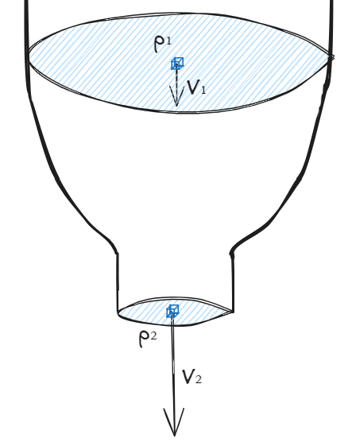


Diese Gleichung ist die Bernoulli-Gleichung. Sie beschreibt den Energieerhaltungssatz für strömende Flüssigkeiten oder Gase ($E_{\text{Druck},1} + E_{\text{kin},1} + E_{\text{pot},1} = E_{\text{Druck},2} + E_{\text{kin},2} + E_{\text{pot},2}$)
$$
p_1 + \frac{1}{2} \rho v_1^2 + \rho g h_1 = p_2 + \frac{1}{2} \rho v_2^2 + \rho g h_2
$$

Sind $h_1 = h_2$ und $v_1 \approx 0$, dann:

$$
p_1 = p_2 + \frac{1}{2} \rho v_2^2 	\Rightarrow v_{\text{Treibstoff}}(t) = \sqrt{ \tfrac{2 \cdot [P(t) - P_{\text{Atm}}]}{\rho} }
$$

* $v_{\text{Treibstoff}}(t)$: Geschwindigkeit des Wassers oder der Gas zum Zeitpunkt $t$ [m/s]
* $P(t)$: Innendruck zum Zeitpunkt $t$ [Pa]
* $P_{\text{Atm}}$: Atmosphärendruck ($\approx 101{,}325 \text{Pa}$) [Pa]
* $\rho$: Dichte des Treibstoffs (≈ $998 \, \text{kg/m³}$ für Wasser, ≈ $1{,}204 \text{kg/m³}$ für Luft)

### 2.2 Massenstrom berechnen

* Der **Massenstrom** $\dot{m}$ [kg/s] ist die Wassermenge, die pro Sekunde aus der Düse fließt:
  $$
  \dot{m}(t) = \rho \cdot A_{\text{Düse}} \cdot v_{\text{Treibstoff}}(t)
  $$

  - $A_{\text{Düse}}$ = Fläche der Düse $A = \pi r_{\text{Düse}}^2$
  
  Setzen wir $v_{\text{Treibstoff}}(t)$ ein:
  $$
  \dot{m}(t) = \rho \cdot A_{\text{Düse}} \cdot \sqrt{ \tfrac{2 \cdot [P(t) - P_{\text{Atm}}]}{\rho} } = A_{\text{Düse}} \cdot \sqrt{2 \rho [P(t) - P_{\text{Atm}}])}
  $$


### 2.3 Korrektur mit Düseneffizienz $C_d$

In der Realität ist der Massenstrom geringer, weil die Düse nicht perfekt ist (z. B. Reibung). Deshalb fügen wir den **Entladungskoeffizienten** $C_d$ (typisch $0.6–0.9$) hinzu:
$$
\dot{m}(t) = A_{\text{Düse}} \cdot \sqrt{2 \rho [P(t) - P_{\text{Atm}}])} \cdot C_d
$$

### 2.4 Schubkraft aus Impulserhaltung

Der **Schub** entsteht durch den Rückstoß des ausgestoßenen Treibstoffs (Newton: Actio = Reactio).
Die Schubkraft ist die **zeitliche Änderung des Impulses**, der vom Treibstoff getragen wird.

| Ausgestoßener Treibstoff | Zeitpunkt $t$ | Zeitpunkt $t+\Delta t$                                       |
| ------------------------ | ------------- | ------------------------------------------------------------ |
| Masse                    | $0$ *         | $\dot{m}(t) \cdot \Delta t$                                  |
| Geschwindigkeit          | $\text{–}$    | $v_{\text{Treibstoff}}(t+\Delta t)$                          |
| Impuls                   | $0$           | $[\dot{m}(t) \cdot \Delta t] \cdot [v_{\text{Treibstoff}}(t+\Delta t)]$ |

<small>* Der Treibstoff, der während des Intervalls $[t, t+\Delta t]$ ausgestoßen wird, ist ist zu Beginn **noch in der Rakete enthalten**</small>

Daher ist der die Schubkraft
$$
F_{\text{Schub}}(t) = \frac{[\dot{m}(t) \cdot \cancel{\Delta t}] \cdot [v_{\text{Treibstoff}}(t+\Delta t)] -0}{\cancel{\Delta t}} = \dot{m}(t) \cdot v_{\text{Treibstoff}}(t+\Delta t)
$$
Für $\Delta t \to 0$ erhalten wir
$$
F_{\text{Schub}}(t) = \dot{m}(t) \cdot v_{\text{Treibstoff}}(t)
$$
Setzen wir $\dot{m}(t)$ und $v_{\text{Treibstoff}}(t)$ ein:
$$
F_{\text{Schub}}(t) = A_{\text{Düse}} \cdot \sqrt{2 \rho [P(t) - P_{\text{Atm}}])} \cdot \sqrt{ \tfrac{2 \cdot [P(t) - P_{\text{Atm}}]}{\rho} } \cdot C_d
$$
Vereinfacht:
$$
F_{\text{Schub}}(t) = A_{\text{Düse}} \cdot 2 \cdot [P(t) - P_{\text{Atm}}] \cdot C_d
$$

### 2.5 Druckänderung während des Fluges $P(t)$

#### 2.5.1 Wasserschubphase

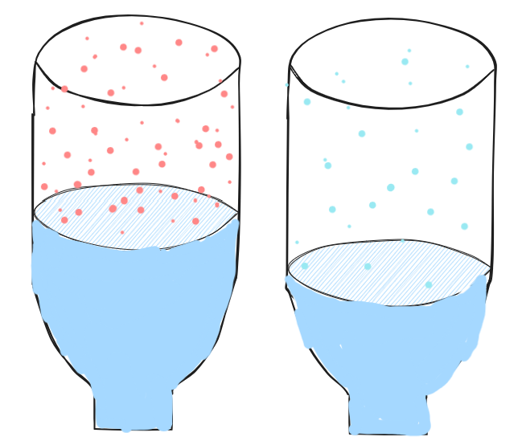

Wir betrachten den Druckabfall als einen adiabatischen Prozess. Das bedeutet:

1. Wenn das Wasser ausgestoßen wird, verrichtet das Gas Arbeit am Wasser ⇒ **die Temperatur sinkt**
2. Sinkt die Temperatur, sinkt auch der **Druck**
3. Da der Prozess sehr schnell abläuft, vernachlässigen wir den Wärmeaustausch
4. In diesem Fall ist der Zusammenhang zwischen Druck und Volumen ist **nicht linear**

Für einen adiabatischen Prozess gilt experimentell:
$$
P \cdot V_{\text{Luft}}^\gamma = \text{konstant}
$$

Daraus ergibt sich der aktuelle Druck in Abhängigkeit vom Luftvolumen:

$$
P(t) = P_{\text{init}} \; \biggl( \tfrac{V_{\text{Luft, init}}}{V_{\text{Luft}}(t)} \biggr)^\gamma
$$

* $V_{\text{Luft, init}}$: Anfangsvolumen der Luft \[m³]
* $V_{\text{Luft}}(t)$: Volumen der Luft zum Zeitpunkt $t$ \[m³]
* $\gamma$: Adiabatenexponent (≈ $1{,}4$ für Luft)

Das Luftvolumen ist direkt mit der verbleibenden Wassermasse verknüpft:
$$
V_{\text{Luft}}(t) = V_{\text{total}} - V_{\text{Wasser}}(t) = V_{\text{total}} - \frac{m_{\text{Wasser}}(t)}{\rho_{\text{Wasser}}}
$$
Die wechselseitige Abhängigkeit von Druck $P(t)$ und Wassersmasse $m_{\text{Wasser}}(t)$ erfordert eine iterative Lösung:
$$
m_{\text{Wasser}}(t + Δt) = m_{\text{Wasser}}(t) - \dot{m}(t) \cdot Δt = m_{\text{Wasser}}(t) - A_{\text{Düse}} \cdot \sqrt{2 \rho [P(t) - P_{\text{Atm}}])} \cdot C_d \cdot Δt
$$
Da diese Gleichungen **schwer analytisch lösbar** sind, verwenden wir eine numerische Simulation (Euler-Verfahren).

Die Simulation läuft in diskreten Zeitschritten $Δt$ (z.B. 0.001 s):

1. Zum Zeitpunkt $t = 0$ sind $m_{\text{Wasser}}(0)$, $V_{\text{Luft}}(0)$ und $P(0)$ als Anfangsbedingungen bekannt

2. Wassermasse zum Zeitpunkt $t = Δt$ :
   $$
   m_{\text{Wasser}}(Δt) = m_{\text{Wasser}}(0) - A_{\text{Düse}} \cdot \sqrt{2 \rho [P(0) - P_{\text{Atm}}])} \cdot C_d \cdot Δt
   $$

3. Luftvolumen zum Zeitpunkt $t = Δt$:
   $$
   V_{\text{Luft}}(Δt) = V_{\text{total}} - \frac{m_{\text{Wasser}}(Δt)}{\rho_{\text{Wasser}}}
   $$

4. Druck zum Zeitpunkt $t = Δt$:
   $$
   P(Δt) = P_{\text{init}} \cdot \left( \frac{V_{\text{Luft, init}}}{V_{\text{Luft}}(Δt)} \right)^\gamma
   $$

5. Schubkraft zum Zeitpunkt $t = Δt$
   $$
   F_{\text{Schub}}(t) = A_{\text{Düse}} \cdot 2 \cdot [P(Δt) - P_{\text{Atm}}] \cdot C_d
   $$

6. Wassermasse zum Zeitpunkt $t = 2Δt$ :
   $$
   m_{\text{Wasser}}(2Δt) = m_{\text{Wasser}}(Δt) - A_{\text{Düse}} \cdot \sqrt{2 \rho [P(Δt) - P_{\text{Atm}}])} \cdot C_d \cdot Δt
   $$

7. ... *(Wiederholen bis Wasser verbraucht ist)*

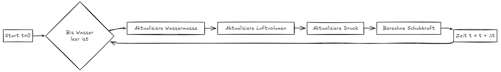

**Mit diesem Verfahren sind $P(t)$ sowie $F_{\text{Schub}}(t)$ während der Wasserschubphase numerisch bestimmbar.** 

#### 2.5.2 Luftschubphase

In der Luftschubphase ist $V(t)$ unbekannt, da Luft aus der Rakete strömt. Deshalb muss man **ideales Gasgesetz** anwenden.

$$
P \cdot V = n \cdot R \cdot T
$$

- $P$ = Druck [Pa]
- $V$ = Volumen [m³]
- $n$ = Stoffmenge [mol]  
- $R$ = Universelle Gaskonstante (≈ $8{,}314 \, \text{J/(mol·K)}$)  
- $T$ = Temperatur [K]

Wir ersetzen die Stoffmenge $n$ durch:
$$
n = \frac{m}{M}
$$

- $M$ = [Molare Masse](https://de.wikipedia.org/wiki/Molare_Masse) des Gases (für Luft: $M_{\text{Luft}} \approx 0{,}02897 \, \text{kg/mol}$).

Einsetzen in das Gasgesetz (Da $R$ und $M$ konstant sind, ergibt sich $\frac{R}{M}$ eine sogenannte **spezifischen Gaskonstante**):
$$
P \cdot V = \frac{m}{M} \cdot R \cdot T = \underbrace{\frac{R}{M}}_{\displaystyle R_{\text{spezifisch}}} \cdot m \cdot T
$$
- Für Luft: $ R_{\text{spezifisch}} = \frac{8{,}314}{0{,}02897} \approx 287 \, \text{J/(kg·K)} $

Dadurch gilt
$$
P(t) = \frac{R_{\text{spezifisch}} \cdot m_{\text{Luft}}(t) \cdot T_{\text{Luft}}(t)}{V_{\text{Luft}}}
$$
Da die Luftschubphase sehr kurz dauert, gehen wir davon aus, dass die Temperatur $T_{\text{Luft}}(t)$ konstant und gleich der Temperatur am Ende der Wasserschubphase ist. Dadurch erhalten wir
$$
T_{\text{Luft}}(t) = T_{\text{Wasser, End}} = \frac{P_{\text{End}} \cdot V_{\text{Luft, End}}}{R_{\text{spezifisch}} \cdot m_{\text{Luft, End}}}
$$
Wir berechnen analog zur Wasserschubphase, aber mit:

- Treibstoffdichte $\rho = \rho_{\text{Luft}}$
- $V_{\text{Luft}} = V_{\text{ges}}$ (kein Wasser mehr vorhanden)

---

## 3. Gravitation $F_G(t)$

Die Gravitation zu jeder Zeitpunkt beträgt $F_G(t) = m(t) \cdot g$

**Gesamtmasse** $m(t) = m_{\text{Rakete}} + m_{\text{Wasser}}(t) + m_{\text{Luft}}(t)$  

- $m_{\text{Leermasse}}$ ist als Anfangsbedingung bekannt
- Während der Wasserschubphase kann $m_{\text{Wasser}}$ durch der numerischen Simulation ermittelt werden, sonst gilt immer $m_{\text{Wasser}} = 0$
- Da $m_{\text{Luft}} \approx 0$ ist, ignorieren wir das 

---

## 4. Luftwiderstand $F_{\text{Drag}}(t)$

Wir verwenden hier die Formel für turbulente Strömung:

$$
F_{\text{Drag}}(t) = \tfrac12 \; \rho_{\text{Luft}} \; C_w \; A_{\text{Rakete}} \; v(t)^2
$$

* $\rho_{\text{Luft}}$: Luftdichte (≈ $1{,}204 \, \text{kg/m³}$)
* $C_w$: Widerstandsbeiwert (≈ $0{,}5$ für Luft)
* $A_{\text{Rakete}}$: Querschnittsfläche ($A_{\text{Rakete}} = \pi r_{\text{Rakete}}^2$)
* $v$: Geschwindigkeit (2. Newtonsche Gesetz: $a = \frac{F}{m} = \frac{F_{\text{Schub}}+F_{\text{G}}+F_{\text{Drag}}}{m}$)

---

## 5. Abweichungen von der Realität

| **Bereich**     | **Abweichung**                                               | **Konsequenz**                                  |
| --------------- | ------------------------------------------------------------ | ----------------------------------------------- |
| **Schub**       | Formel $F_{\text{Schub}}(t) = A_{\text{Düse}} \cdot 2 \cdot [P(t) - P_{\text{Atm}}] \cdot C_d$ für kompressible Luft ungenau | Schub ungenau                                   |
|                 | Düseneffizienz schwer bestimmbar, aktueller Wert nur geschätzt | Massenstrom ungenau                             |
| **Masse**       | Luftmasse nicht berücksichtigt                               | Masse unterschätzt → Beschleunigung überschätzt |
| **Temperatur**  | Konstante Lufttemperatur $T_{\text{Luft}}$ angenommen        | Druckabfall zu langsam modelliert               |
|                 | Wärmetransport zur Raketenwand vernachlässigt                | Innentemperatur zu niedrig simuliert            |
| **Integration** | Verwendung des Euler-Verfahrens                              | Fehler bei Positionsberechnung                  |
| **Strömung**    | Wind und Turbulenzen nicht berücksichtigt → Flugbahn ist eine senkrechte Linie nach oben. | Flugbahn ungenau simuliert                      |
| **Mechanik**    | Reibung in der Startdüse ignoriert                           | Startgeschwindigkeit zu hoch simuliert          |

# II. Computer-Simulation

Um das Verhalten der Wasserrakete genauer zu untersuchen, nutzen wir ein Python-Skript.

**Für nicht erwähnte Variablen wurden die folgenden Werte verwendet:**

```python
g = 9.81                # Erdbeschleunigung [m/s²]
luftdichte = 1.204      # Dichte der Luft [kg/m³]
wasserdichte = 998     # Dichte von Wasser [kg/m³]
atmosphärendruck = 101325 # Atmosphärendruck [Pa]
gamma = 1.4             # Adiabatenindex für Luft
R_spezifisch = 287      # Spezifische Gaskonstante für Luft [J/(kg·K)]
Cd_wasser = 0.97        # Entladungskoeffizient für Wasser
Cd_luft = 0.8           # Entladungskoeffizient für Luft
Cw = 0.5                # Luftwiderstandsbeiwert

leermasse = 80         # Masse der leeren Rakete [g]
total_volumen = 1.5       # Gesamtvolumen der Rakete [l]
wasservolumen_initial = 0.8  # Anfangsvolumen des Wassers [l]
düsendurchmesser = 22   # Durchmesser der Düse [mm]
druck_initial = 4      # Anfangsdruck in der Rakete [bar]
rocketdurchmesser = 83 # Durchmesser der Rakete [mm]
umgebungstemperatur = 25 # Umgebungstemperatur [C]

dt = 0.0001 # Zeitschritt [s]
```

## 1. Verhalten der Rakete mit bestimmten Bedingungen

### 1.1 Ergebnis

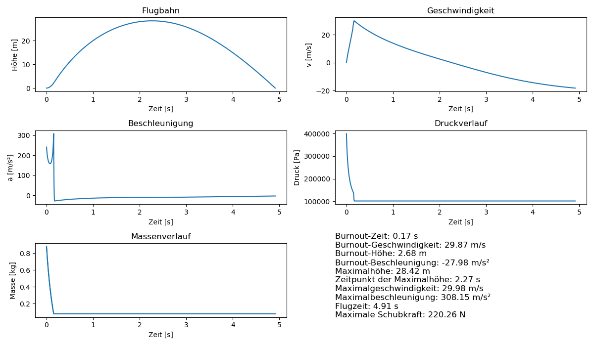

### 1.2 Besondere Merkmale und Interpretation

#### 1.2.1 Geschwindigkeit

Die Geschwindigkeit der Rakete steigt in der Schubphase sehr schnell an, erreicht ihr Maximum bei **0,17 s** und sinkt danach wieder.

**0,17 - 2,27 s (Teil des Freiflugs):**

v sinkt, aber Kurve ist links gekrümmt, d.h. Abnahme verlangsamt sich allmählich

- In diesem Abschnitt verliert die Rakete bereits den Schub, bewegt sich aber aufgrund der Trägheit weiter nach oben. 
- Luftwiderstand und Schwerkraft wirken entgegen der Bewegungsrichtung ⟹ Die Geschwindigkeit nimmt ab ⟹ Der Luftwiderstand verringert sich ⟹ Die Geschwindigkeit nimmt nicht linear, sondern immer langsamer ab.

**2,27 - 4,91 s (Teil des Freiflugs):**

v sinkt, aber Kurve ist links gekrümmt, d.h. Abnahme verlangsamt sich allmählich

- Die Rakete hat den höchsten Punkt erreicht und beginnt, wieder nach unten zu fallen.
- Die Rakete fällt schneller ⟹ Luftwiderstand wird größer, während die Schwerkraft konstant bleibt ⟹ Die Fallgeschwindigkeit nimmt allmählich weniger stark zu. (Der Abstieg verläuft mit immer geringerem Tempo)

---

#### 1.2.2 Druckverlauf

**0 – 0,15 s (Wasserschubphase)**
Der Druck in der Rakete sinkt sehr schnell. Die Kurve ist leicht links gekrümmt, was bedeutet: Der Druckabfall wird anfangs schneller erfolgt und später etwas langsamer.
Werfen wir einen Blick auf die Flugdaten *(Stichprobe mit einer Schrittlänge von 0,000200 in der Spalte „Wasservolumen [m³]“)*:

| Index | Zeit [s] | $\Delta t$ | Wasservolumen [m³] | $\Delta V$ | Masse [kg] | $\Delta m$ | Druck [Pa] | $\Delta p$ |
| ----: | -------: | ---------: | -----------------: | ---------: | ---------: | ---------: | ---------: | ---------- |
|     0 |   0.0000 |      *NaN* |           0.000799 |      *NaN* |      0.877 |      *NaN* |   399279.4 | *NaN*      |
|    50 |   0.0250 |     0.0250 |           0.000601 |  -0.000198 |      0.680 |     -0.197 |   281871.4 | -117408.0  |
|   115 |   0.0575 |     0.0325 |           0.000400 |  -0.000201 |      0.479 |     -0.201 |   212371.0 | -69500.0   |
|   197 |   0.0985 |     0.0410 |           0.000201 |  -0.000199 |      0.281 |     -0.198 |   168320.6 | -44050.4   |
|   306 |   0.1530 |     0.0545 |           0.000000 |  -0.000201 |      0.080 |     -0.201 |   137680.0 | -30640.6   |

Man erkennt deutlich: Obwohl das Wasservolumen in etwa gleichmäßig abnimmt, verlangsamt sich der Druckabfall zunehmend:

Der Druck hängt nämlich vor allem vom Verhältnis $\frac{V_{\text{Luft, init}}}{V_{\text{Luft}}(Δt)}$ ab. Dieses Verhältnis folgt dem typischen Verlauf einer **umgekehrt proportionalen Funktion** – je größer das Luftvolumen im Inneren wird, desto langsamer sinkt der Druck. Wenn wir jetzt die Zeit anschauen, sinkt die Wasservolumen selbst sogar immer langsamer, das liegt daran, dass der Druck sinkt und dadurch pro Zeiteinheit weniger Wasser ausgestoßen wird. Das wiederum führt dazu, dass der Druck noch langsamer sinkt – **ein sich selbst abschwächender Prozess**.

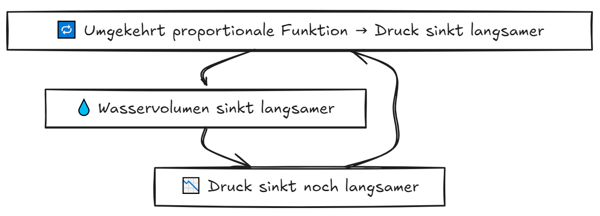

**0,15 – 0,17 s (Luftschubphase)**
Der Druck fällt nun dramatisch bis auf den Atmosphärendruck ab, da die restliche Luft sehr schnell ausgestoßen wird.

**Nach 0,17 s (Freiflug)**
Der Druck stabilisiert sich in der Nähe des Atmosphärendrucks (ca. 101 325 Pa).

---

#### 1.2.3 Beschleunigung

**0 – 0,17 s (Schubphase):**

1. Die Beschleunigung steigt sprunghaft bis **242 m/s²** (etwa 25 g)
2. Kurze Abfallphase, dann erneuter Anstieg bis **Maximalwert 308 m/s²** (≈ 94 g)

Im folgenden Diagramm ist die **prozentuale Entwicklung** von *Masse, Druckunterschied, Beschleunigung und Schubkraft* dargestellt (jeweils bezogen auf den Anfangswert).

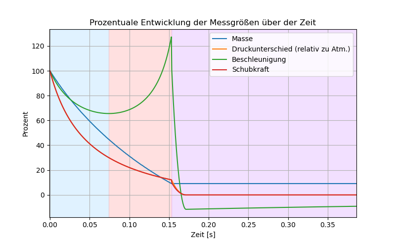
(Die Kurve des Druckunterschieds ist im Bild nicht sichtbar, da sie genau mit der der Schubkraft überlappt.)

Die Masse nimmt ungefähr gleichmäßig ab, der Druckunterschied sowie die Schubkraft hingegen verringert sich aber immer langsamer (Die Erklärung dazu wurde bereits gegeben). Die Beschleunigung ergibt sich näherungsweise aus dem Verhältnis $\frac{\text{Schubkraft}}{\text{Masse}}$ (Näherungsweise, weil auch Gravitation und Luftwiderstand eine Rolle spielen).

- Im **blauen Bereich (0–0,074 s)** nimmt die Schubkraft schneller ab als die Masse → die Beschleunigung sinkt.
- Im **orangenen Bereich (0,074–0,153 s)** nimmt die Schubkraft langsamer ab als die Masse → die Beschleunigung steigt.
- Bei **0,153 s** erreicht die Beschleunigung ihren Höchstwert – sogar 27% höher als zu Beginn. Danach beginnt die Luftschubphase, gefolgt vom freien Flug (violetter Bereich) → die Beschleunigung fällt abrupt ab.

**Bei 0,17 s (Brennschluss)**

Die Beschleunigung fällt plötzlich auf **−28 m/s²**, weil kein Schub mehr vorhanden ist und nur noch Schwerkraft sowie Luftwiderstand wirken.

**Nach 0,17 s (Freiflug)**

Die Rakete fliegt ohne eigenen Antrieb weiter. Die Beschleunigung nähert sich dem Wert von **−9,81 m/s²**, was der Erdbeschleunigung entspricht.

## 2. Wie die Anfangsbedingungen das Flugverhalten beeinflussen

### 2.1 Wasservolumen

Wir variieren das Start-Wasservolumen zwischen **0 l** und **1,5 l** und zeichnen die maximale Flughöhe auf. Das Diagramm zeigt ein Optimum bei **0,35 l**.

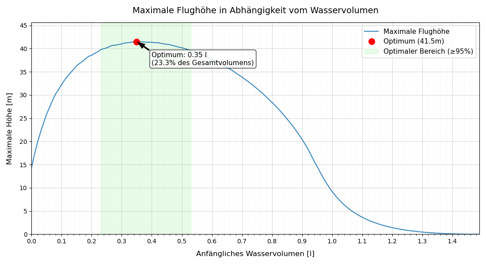

> [!Note]
> In der Praxis soll das optimale Volumen je nach Messung zwischen **0,23 l** und **0,53 l** (Optimaler Bereich) liegen.

**Warum gibt es ein Optimum?**

- **Zu wenig Wasser** → Schubphase sehr kurz → Nicht genug Schubkraft

- **Zu viel Wasser** → Der Druck nimmt schnell ab, während die Masse langsamer abnimmt → Wenig Schub

- **0 l Wasser** → Luft allein treibt die Rakete an → Maximale Höhe ist nicht null
  - *⚠ Wegen der ungenauen Simulation des Luftschubs ist die Höhe hier eventuell überschätzt*
- **Volles Volumen** → Kein Platz für Luft → kein Druckaufbau → Höhe: null

------

### 2.2 Druck

Wir variieren den Flascheninnendruck von **1 bar** bis **20 bar**.

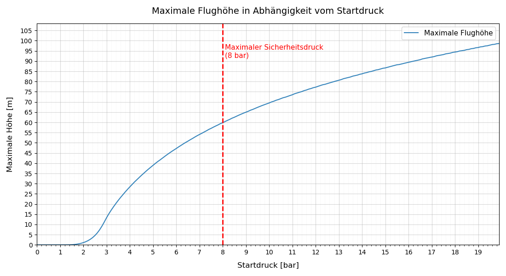

**Beobachtung:** Mit steigendem Druck steigt die Flughöhe. Allerdings nimmt die Schubdauer ab, deshalb ist die Kurve rechts gekrümmt.

### 2.3 Düsendurchmesser

Wir testen Düsendurchmesser zwischen **10 mm** und **80 mm**. Die Höhe-Kurve hängt jedoch auch von der Druck ab.

**Bei niedrigem Druck (z.B. 4 bar)**

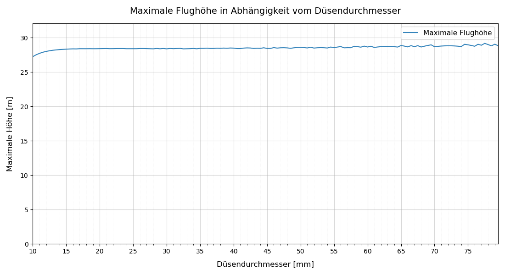

**Bei höherem Druck (z.B. 8 bar)**

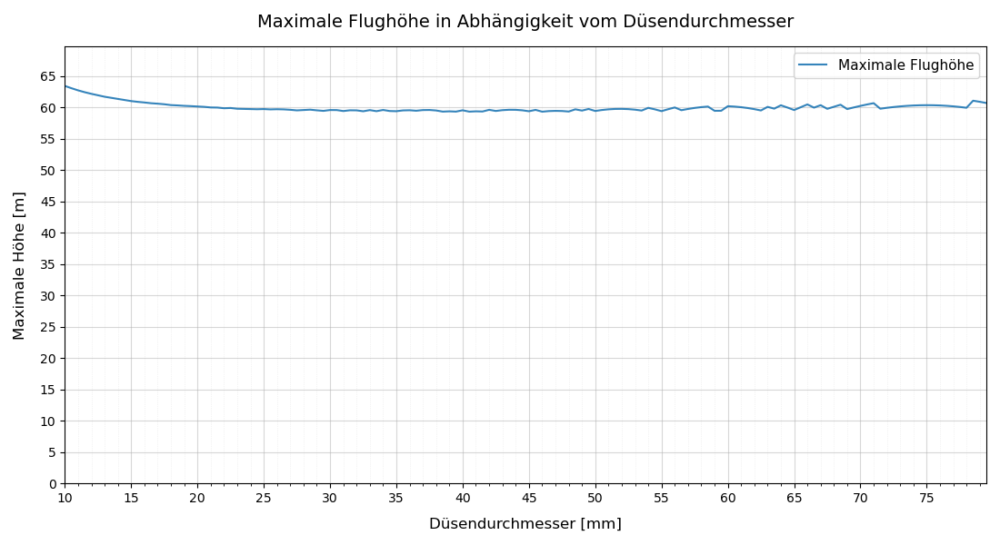

#### 2.3.1 Kleiner Durchmesser (z.B. 10 mm)

Eine schmale Düse bringt folgenden Einflüsse mit sich:

| **Einflussfaktor**    | **Positive Effekte kleiner Düsen**                           | **Negative Effekte kleiner Düsen**                           |
| --------------------- | ------------------------------------------------------------ | ------------------------------------------------------------ |
| **1. Schubdauer**     | Längere Schubphase → Höherer Gesamtimpuls                    | **Gravitationsverluste ↑**: Rakete bleibt länger im Schwerefeld, sodass mehr Energie gegen die Gravitation "verschwendet" sind. |
| **2. Schubkraft**     | Kinetische Energie des austretenden Wassers:<br />$$E_{\text{kin, Wasser}} = \frac{1}{2} m v^2$$<br />Kleiner Düse → Höherer Druckerhalt → Die austretende Masse $m$ zwar kleiner, aber die Geschwindigkeit $v$ höher → ergibt insgesamt **mehr kinetische Energie**. | Bei niedrigem Druck ist $v$ generell kleiner, dagegen spielt jetzt $m$ eine größere Rolle |
| **3. Luftwiderstand** | Geringere Spitzengeschwindigkeit → $F_D \propto v^2$ bleibt niedrig | Die Schubphase dauert länger → Der Impuls des Luftwiderstands ist höher |

- Bei niedrigem Druck überwiegen die negative Effekte kleiner Düse: **Großteil der Energie wird gegen Gravitation "verbrannt"**, statt in Höhe umgesetzt.
- Bei höherem Druck überwiegen die positive Effekte kleiner Düse: Die Austrittsgeschwindigkeit $v$ ist jetzt deutlich höher, deshalb steigt auch die $E_{\text{kin, Wasser}}$ quadratisch

> [!CAUTION]
> In der Realität soll kleinere Düse nur mit Vorsicht verwendet werden. Ein längere Schubdauer gibt Wind, Luftwirbeln oder Startunwuchten mehr Zeit, um die Rakete abzulenken. Daher wird die Flugbahn instabiler und eine theoretische Flughöhe kann schwer erreicht werden.

#### 2.3.2 Großer Durchmesser (z.B. 120 mm)

**Sprünge im Diagramm**

Es tritt manchmal **sprunghafte Zacken** in den Kurven (vor allem bei breiterer Düse) auf. Der Grund dafür liegt in der Art, wie die Simulation läuft – nämlich in **diskreten Zeitschritten (Δt)**.

Stellen wir uns vor:

- Die tatsächliche **Schubphase** dauert z. B. **0,145 Sekunden**.
- Die Simulation arbeitet aber nur mit Zeitschritten von **Δt = 0,1 s**.
- Dadurch kann sie nicht genau erkennen, wann das Wasser tatsächlich aufhört zu beschleunigen.

Was passiert dann?

- Liegt das tatsächliche Ende der Schubphase **zwischen zwei Zeitschritten**, wird die Schubkraft **zu lang** berechnet → die Höhe wird überschätzt.
- Trifft das Ende der Schubphase **genau auf einen Zeitschritt**, wird der Wert korrekt berechnet.
- Je **höher der Druck**, desto stärker fällt der Fehler ins Gewicht.

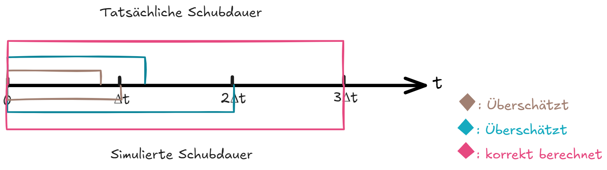

**"Höherer" Flug**

Im Diagramm scheint die Rakete mit großer Düse ein bisschen höher zu fliegen, aber hier ist wiederum ein Problem der Simulation.

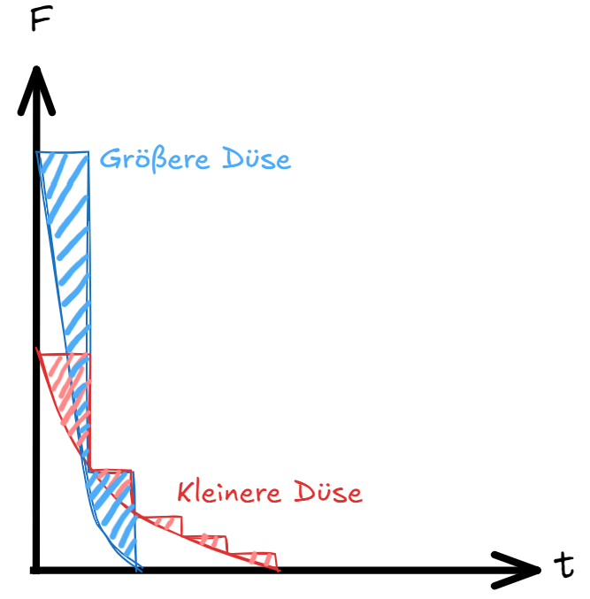

In diesem Diagramm zeigt die geschwungene Kurve den echten Verlauf der Schubkraft. Die gezackte Linie stellt die Schubkraft dar, wie sie vom Computer simuliert wird. Die farbigen Flächen sind die Schubkräft, die  vom Computer überschätzt wurde.

Bei der größeren Düse (blau) ist diese Überschätzung viel stärker. Das führt dazu, dass der Computer eine höhere Flughöhe berechnet, als in der Realität erreicht wird.

> [!TIP]
> Mit Δt = **0,00001 s** (10-mal kleiner) ergibt sich eine relativ glatte und monotone umgekehrte "L"‑Kurve.
> 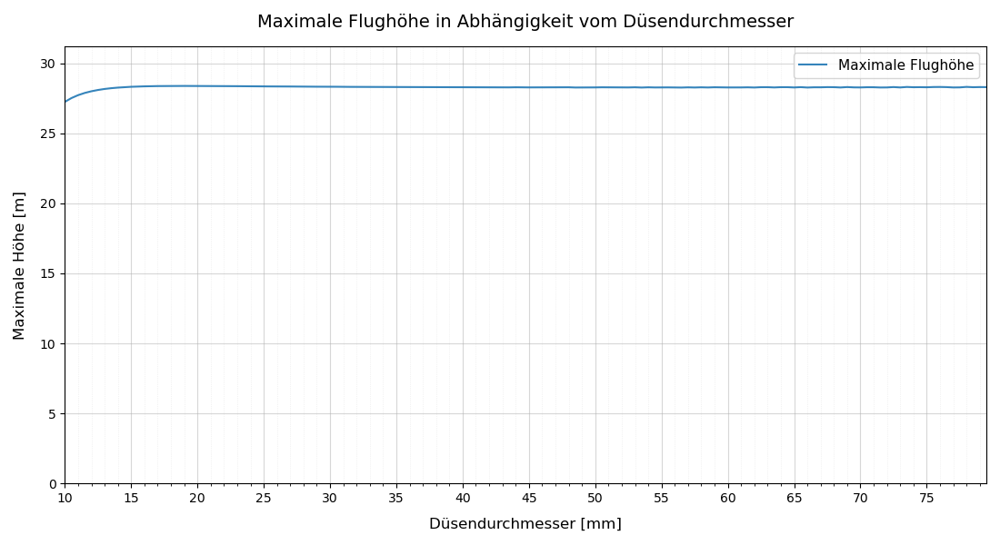